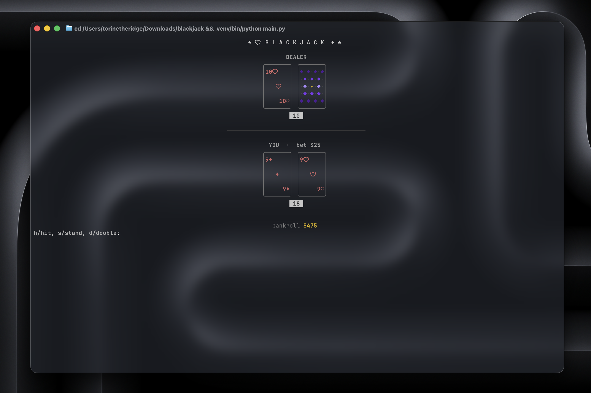

<div align="center">

```
████  █      ███   ████ █   █   ███  ███   ████ █   █
█   █ █     █   █ █     █  █     █  █   █ █     █  █
████  █     █████ █     ███      █  █████ █     ███
█   █ █     █   █ █     █  █  █  █  █   █ █     █  █
████  █████ █   █  ████ █   █  ██   █   █  ████ █   █
```

**A blackjack table that lives in your terminal.**

Hand-drawn ASCII cards, animated deals, a typewriter title screen, and not a single pixel of Electron.

♠ &nbsp;·&nbsp; ♥ &nbsp;·&nbsp; ♦ &nbsp;·&nbsp; ♣

</div>

---

## Preview



## Features

- **Hand-drawn cards** — rounded corners, suit-colored ranks, a genuinely cool purple diamond-lattice card back (not the usual `[X]`)
- **Real animation** — cards deal in one at a time, the dealer's hole card flips face-up, results slide in with a highlight
- **Typewriter title screen** — big block-letter logo types itself out with a blinking cursor on launch
- **Real rules** — 4-deck shoe with auto-reshuffle, dealer hits soft 17, blackjack pays 3:2, hit / stand / double
- **One dependency** — just [`rich`](https://github.com/Textualize/rich), nothing else

## Quickstart

```bash
git clone https://github.com/torinriley/blackjack.git
cd blackjack
python3 -m venv .venv && source .venv/bin/activate
pip install -r requirements.txt
python3 main.py
```

That's it — you're at the table.

## How to play

| Input | Action |
|---|---|
| `h` | Hit |
| `s` | Stand |
| `d` | Double down *(first two cards only)* |
| `q` | Cash out and quit |

Start with a $500 bankroll. Blackjack pays 3:2. Dealer hits on soft 17. Keep playing until you bust out or walk away.

## Project layout

```
blackjack/
├── main.py             entry point
└── blackjack/
    ├── cards.py         deck, shoe, hand scoring
    ├── ui.py             card art, title animation, table rendering
    └── game.py          game loop, betting, dealer AI
```

## Requirements

- Python 3.10+
- A terminal that supports Unicode + 256 colors (any modern macOS/Linux terminal, Windows Terminal)

---

<div align="center">

*by torin*

</div>
